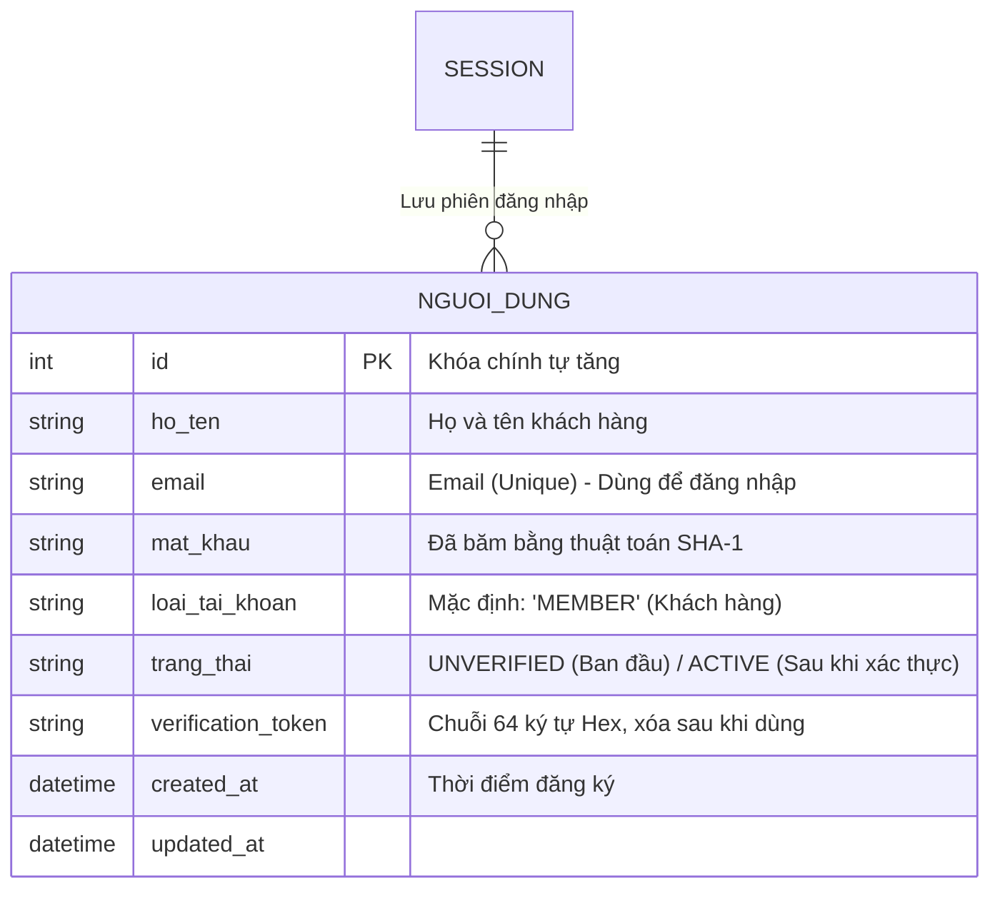

```mermaid
erDiagram
    NGUOI_DUNG {
        int id PK "Khóa chính tự tăng"
        string ho_ten "Họ và tên khách hàng"
        string email "Email (Unique) - Dùng để đăng nhập"
        string mat_khau "Đã băm bằng thuật toán SHA-1"
        string loai_tai_khoan "Mặc định: 'MEMBER' (Khách hàng)"
        string trang_thai "UNVERIFIED (Ban đầu) / ACTIVE (Sau khi xác thực)"
        string verification_token "Chuỗi 64 ký tự Hex, xóa sau khi dùng"
        datetime created_at "Thời điểm đăng ký"
        datetime updated_at 
    }
    
    %% Quan hệ tượng trưng với Session (hệ thống)
    SESSION ||--o{ NGUOI_DUNG : "Lưu phiên đăng nhập"
```
