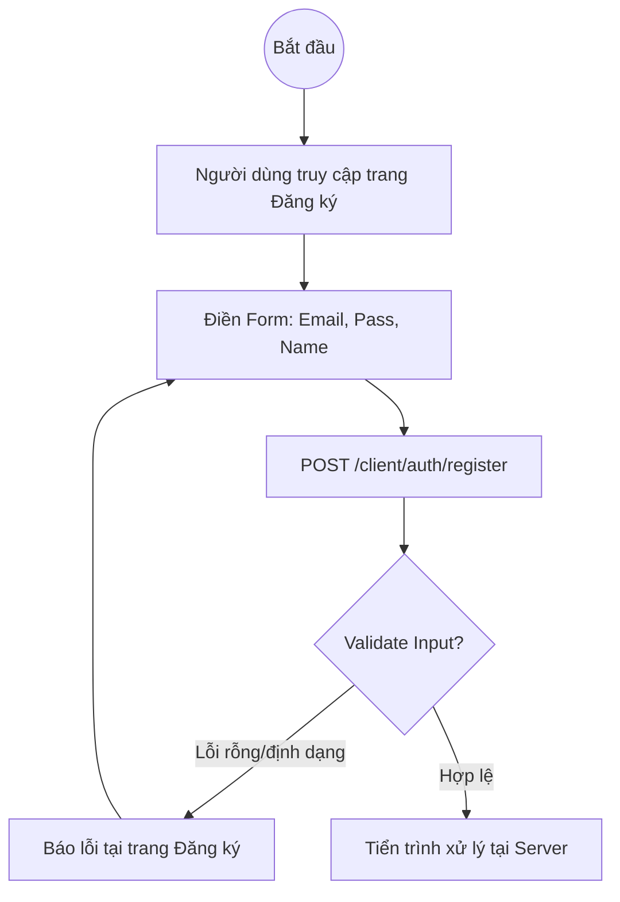
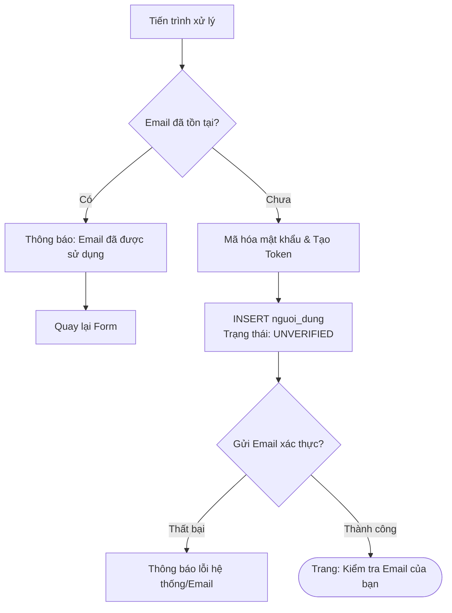
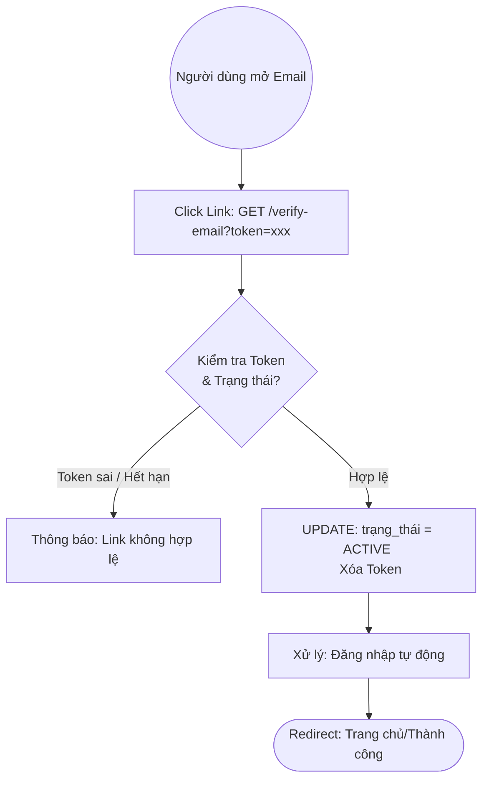

### 1. Tiếp nhận thông tin và kiểm tra sơ bộ

```mermaid
graph TD
    Start((Bắt đầu)) --> A[Người dùng truy cập trang Đăng ký]
    A --> B[Điền Form: Email, Pass, Name]
    B --> C[POST /client/auth/register]
    
    %% Controller Validation
    C --> D{Validate Input?}
    D -- Lỗi rỗng/định dạng --> E[Báo lỗi tại trang Đăng ký]
    E --> B
    D -- Hợp lệ --> F[Tiển trình xử lý tại Server]
```
### 2. Xử lý nghiệp vụ và lưu trữ

```mermaid
graph TD
    F[Tiến trình xử lý] --> G{Email đã tồn tại?}
    G -- Có --> H[Thông báo: Email đã được sử dụng]
    H --> B[Quay lại Form]
    
    G -- Chưa --> I[Mã hóa mật khẩu & Tạo Token]
    I --> J[INSERT nguoi_dung <br/>Trạng thái: UNVERIFIED]
    
    J --> K{Gửi Email xác thực?}
    K -- Thất bại --> L[Thông báo lỗi hệ thống/Email]
    K -- Thành công --> M([Trang: Kiểm tra Email của bạn])
```

### 3. Xác thực email và kích hoạt tài khoản

```mermaid
graph TD
    M((Người dùng mở Email)) --> N[Click Link: GET /verify-email?token=xxx]
    N --> O{Kiểm tra Token <br/>& Trạng thái?}
    
    O -- Token sai / Hết hạn --> P[Thông báo: Link không hợp lệ]
    
    O -- Hợp lệ --> Q[UPDATE: trạng_thái = ACTIVE <br/> Xóa Token]
    Q --> R[Xử lý: Đăng nhập tự động]
    R --> S([Redirect: Trang chủ/Thành công])
```
