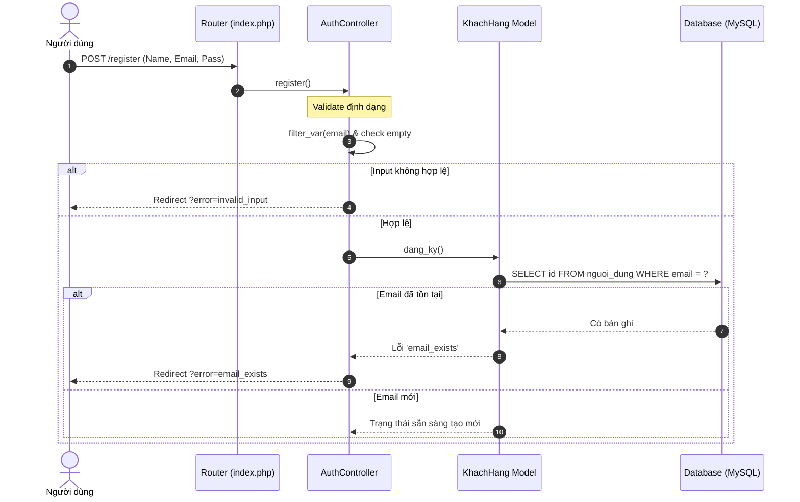
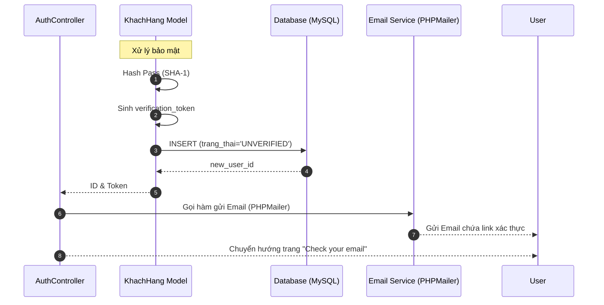
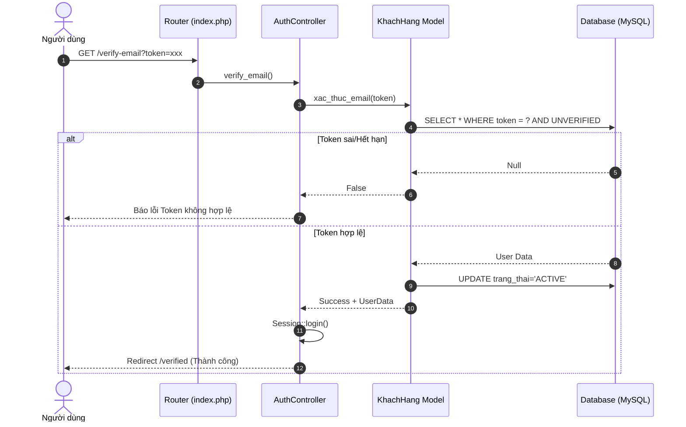

### 1. Tiếp nhận đăng kí và kiểm tra Email

```mermaid
sequenceDiagram
    autonumber
    actor User as Người dùng
    participant Router as Router (index.php)
    participant Ctrl as AuthController
    participant Model as KhachHang Model
    participant DB as Database (MySQL)
    
    User->>Router: POST /register (Name, Email, Pass)
    Router->>Ctrl: register()
    
    Note over Ctrl: Validate định dạng
    Ctrl->>Ctrl: filter_var(email) & check empty
    
    alt Input không hợp lệ
        Ctrl-->>User: Redirect ?error=invalid_input
    else Hợp lệ
        Ctrl->>Model: dang_ky()
        Model->>DB: SELECT id FROM nguoi_dung WHERE email = ?
        
        alt Email đã tồn tại
            DB-->>Model: Có bản ghi
            Model-->>Ctrl: Lỗi 'email_exists'
            Ctrl-->>User: Redirect ?error=email_exists
        else Email mới
            Model-->>Ctrl: Trạng thái sẵn sàng tạo mới
        end
    end
```

### 2. Khởi tạo tài khoản và gửi Mail

```mermaid
sequenceDiagram
    autonumber
    participant Ctrl as AuthController
    participant Model as KhachHang Model
    participant DB as Database (MySQL)
    participant Mail as Email Service (PHPMailer)
    
    Note over Model: Xử lý bảo mật
    Model->>Model: Hash Pass (SHA-1)
    Model->>Model: Sinh verification_token
    
    Model->>DB: INSERT (trang_thai='UNVERIFIED')
    DB-->>Model: new_user_id
    Model-->>Ctrl: ID & Token
    
    Ctrl->>Mail: Gọi hàm gửi Email (PHPMailer)
    Mail-->>User: Gửi Email chứa link xác thực
    Ctrl-->>User: Chuyển hướng trang "Check your email"
```

### 3. Xác thực Token và đăng nhập tự động

```mermaid
sequenceDiagram
    autonumber
    actor User as Người dùng
    participant Router as Router (index.php)
    participant Ctrl as AuthController
    participant Model as KhachHang Model
    participant DB as Database (MySQL)

    User->>Router: GET /verify-email?token=xxx
    Router->>Ctrl: verify_email()
    Ctrl->>Model: xac_thuc_email(token)
    
    Model->>DB: SELECT * WHERE token = ? AND UNVERIFIED
    
    alt Token sai/Hết hạn
        DB-->>Model: Null
        Model-->>Ctrl: False
        Ctrl-->>User: Báo lỗi Token không hợp lệ
    else Token hợp lệ
        DB-->>Model: User Data
        Model->>DB: UPDATE trang_thai='ACTIVE'
        Model-->>Ctrl: Success + UserData
        
        Ctrl->>Ctrl: Session::login()
        Ctrl-->>User: Redirect /verified (Thành công)
    end
```
