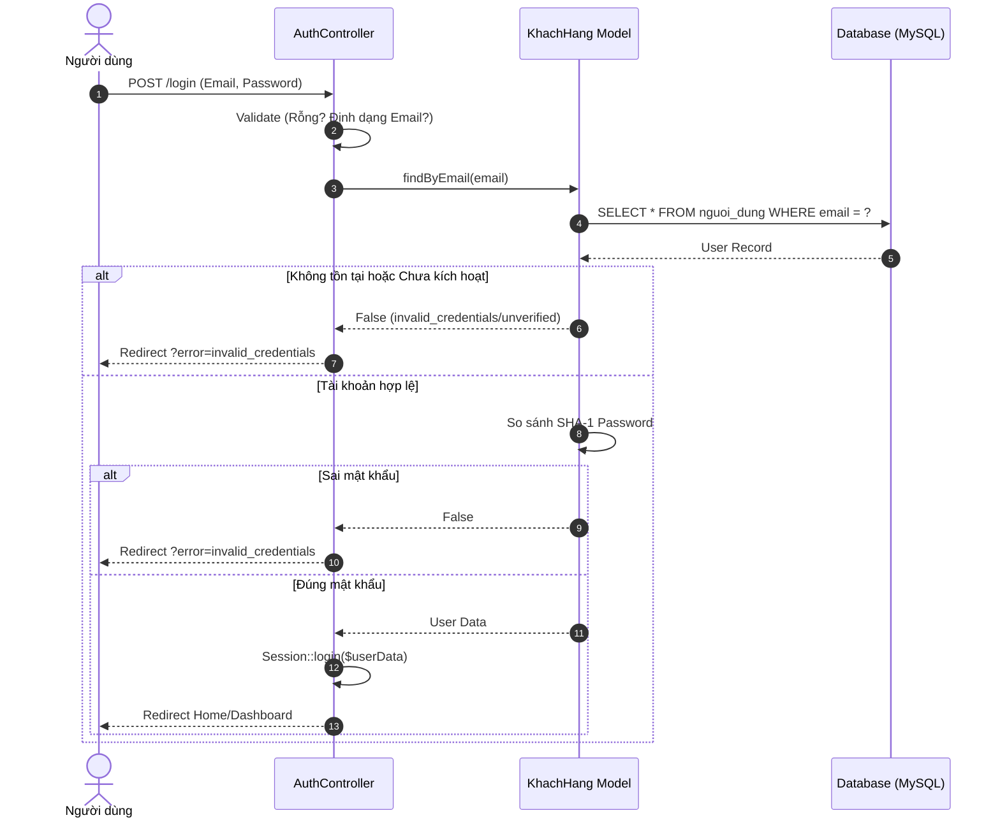
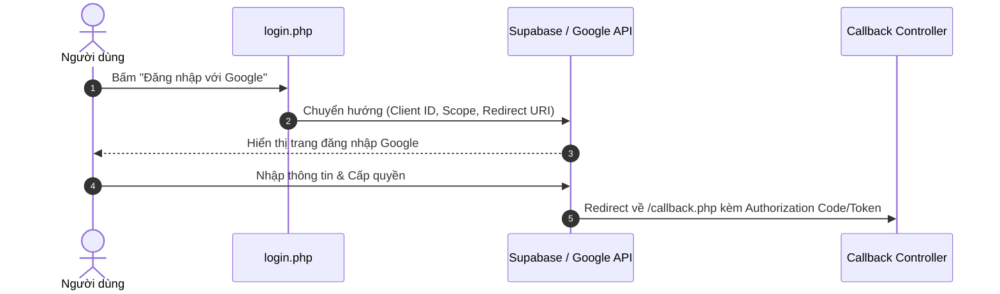
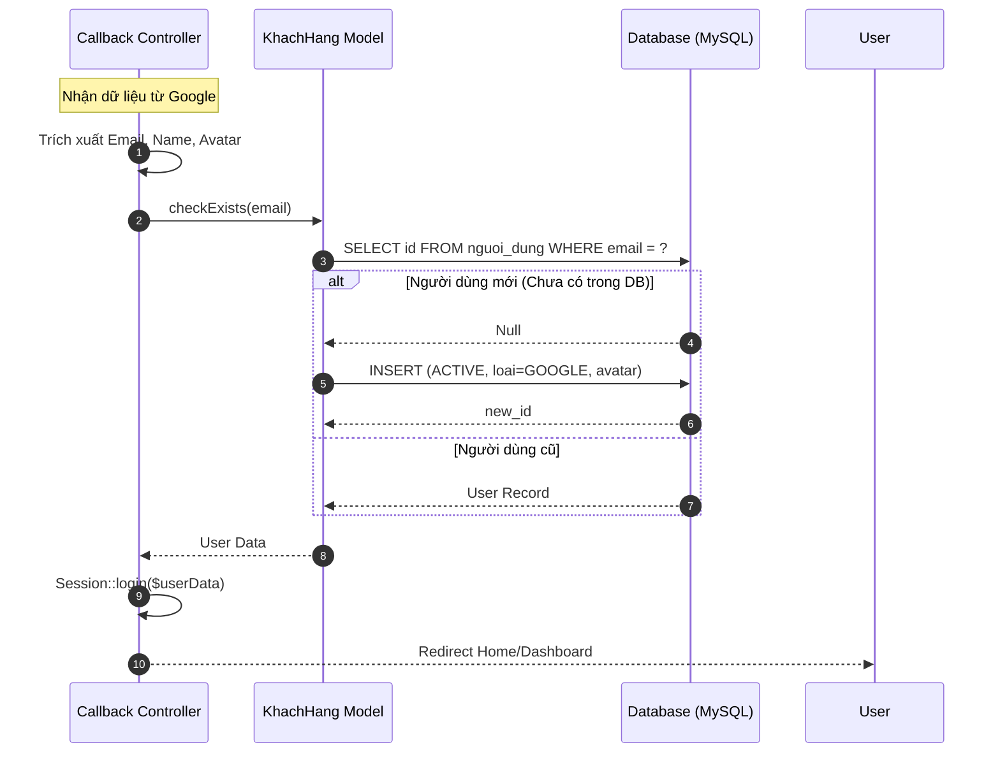

### 1. Đăng nhập truyền thống (Email và Password)

```mermaid
sequenceDiagram
    autonumber
    actor User as Người dùng
    participant Ctrl as AuthController
    participant Model as KhachHang Model
    participant DB as Database (MySQL)

    User->>Ctrl: POST /login (Email, Password)
    Ctrl->>Ctrl: Validate (Rỗng? Định dạng Email?)
    
    Ctrl->>Model: findByEmail(email)
    Model->>DB: SELECT * FROM nguoi_dung WHERE email = ?
    DB-->>Model: User Record
    
    alt Không tồn tại hoặc Chưa kích hoạt
        Model-->>Ctrl: False (invalid_credentials/unverified)
        Ctrl-->>User: Redirect ?error=invalid_credentials
    else Tài khoản hợp lệ
        Model->>Model: So sánh SHA-1 Password
        alt Sai mật khẩu
            Model-->>Ctrl: False
            Ctrl-->>User: Redirect ?error=invalid_credentials
        else Đúng mật khẩu
            Model-->>Ctrl: User Data
            Ctrl->>Ctrl: Session::login($userData)
            Ctrl-->>User: Redirect Home/Dashboard
        end
    end
```

### 2. Google OAuth - Luồng điều hướng và cấp quyền

```mermaid
sequenceDiagram
    autonumber
    actor User as Người dùng
    participant View as login.php
    participant OAuth as Supabase / Google API
    participant Ctrl as Callback Controller

    User->>View: Bấm "Đăng nhập với Google"
    View->>OAuth: Chuyển hướng (Client ID, Scope, Redirect URI)
    OAuth-->>User: Hiển thị trang đăng nhập Google
    User->>OAuth: Nhập thông tin & Cấp quyền
    OAuth->>Ctrl: Redirect về /callback.php kèm Authorization Code/Token
```

### 3. Google OAuth - Xử lý Token và ăng nhập tự động

```mermaid
sequenceDiagram
    autonumber
    participant Ctrl as Callback Controller
    participant Model as KhachHang Model
    participant DB as Database (MySQL)

    Note over Ctrl: Nhận dữ liệu từ Google
    Ctrl->>Ctrl: Trích xuất Email, Name, Avatar
    
    Ctrl->>Model: checkExists(email)
    Model->>DB: SELECT id FROM nguoi_dung WHERE email = ?
    
    alt Người dùng mới (Chưa có trong DB)
        DB-->>Model: Null
        Model->>DB: INSERT (ACTIVE, loai=GOOGLE, avatar)
        DB-->>Model: new_id
    else Người dùng cũ
        DB-->>Model: User Record
    end
    
    Model-->>Ctrl: User Data
    Ctrl->>Ctrl: Session::login($userData)
    Ctrl-->>User: Redirect Home/Dashboard
```
