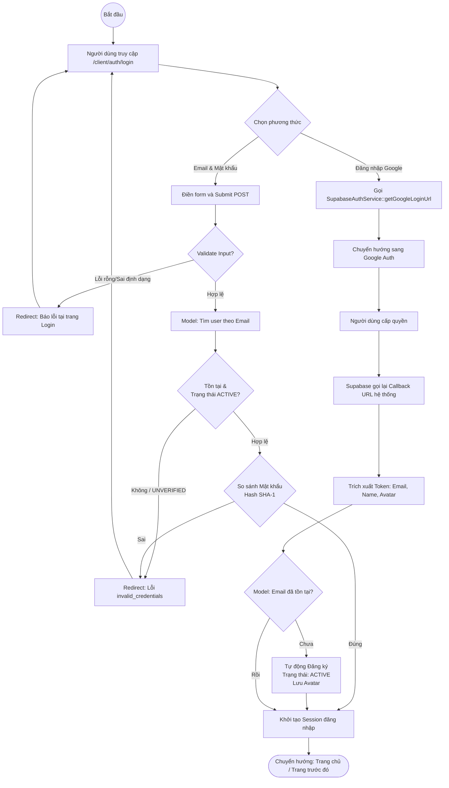

```mermaid
graph TD
    Start((Bắt đầu)) --> View[Người dùng truy cập /client/auth/login]
    View --> Choice{Chọn phương thức}

    %% Đăng nhập truyền thống
    Choice -- Email & Mật khẩu --> T1[Điền form và Submit POST]
    T1 --> T2{Validate Input?}
    T2 -- Lỗi rỗng/Sai định dạng --> Err1[Redirect: Báo lỗi tại trang Login]
    Err1 --> View
    
    T2 -- Hợp lệ --> T3[Model: Tìm user theo Email]
    T3 --> T4{Tồn tại & <br/>Trạng thái ACTIVE?}
    T4 -- Không / UNVERIFIED --> Err2[Redirect: Lỗi invalid_credentials]
    Err2 --> View
    
    T4 -- Hợp lệ --> T5{So sánh Mật khẩu<br/>Hash SHA-1}
    T5 -- Sai --> Err2
    T5 -- Đúng --> Session[Khởi tạo Session đăng nhập]

    %% Đăng nhập Google (OAuth)
    Choice -- Đăng nhập Google --> G1[Gọi SupabaseAuthService::getGoogleLoginUrl]
    G1 --> G2[Chuyển hướng sang Google Auth]
    G2 --> G3[Người dùng cấp quyền]
    G3 --> G4[Supabase gọi lại Callback URL hệ thống]
    G4 --> G5[Trích xuất Token: Email, Name, Avatar]
    G5 --> G6{Model: Email đã tồn tại?}
    G6 -- Chưa --> G7[Tự động Đăng ký <br/>Trạng thái: ACTIVE <br/>Lưu Avatar]
    G7 --> Session
    G6 -- Rồi --> Session

    %% Kết thúc
    Session --> End([Chuyển hướng: Trang chủ / Trang trước đó])
```
