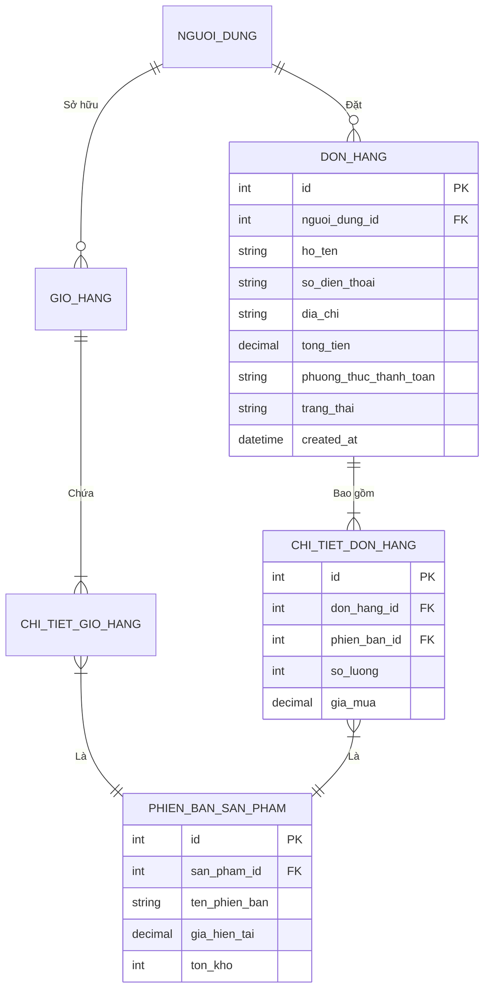

```mermaid
erDiagram
    NGUOI_DUNG ||--o{ GIO_HANG : "Sở hữu"
    NGUOI_DUNG ||--o{ DON_HANG : "Đặt"
    
    GIO_HANG ||--|{ CHI_TIET_GIO_HANG : "Chứa"
    CHI_TIET_GIO_HANG }|--|| PHIEN_BAN_SAN_PHAM : "Là"
    
    DON_HANG ||--|{ CHI_TIET_DON_HANG : "Bao gồm"
    CHI_TIET_DON_HANG }|--|| PHIEN_BAN_SAN_PHAM : "Là"

    DON_HANG {
        int id PK
        int nguoi_dung_id FK
        string ho_ten
        string so_dien_thoai
        string dia_chi
        decimal tong_tien
        string phuong_thuc_thanh_toan
        string trang_thai
        datetime created_at
    }

    CHI_TIET_DON_HANG {
        int id PK
        int don_hang_id FK
        int phien_ban_id FK
        int so_luong
        decimal gia_mua
    }

    PHIEN_BAN_SAN_PHAM {
        int id PK
        int san_pham_id FK
        string ten_phien_ban
        decimal gia_hien_tai
        int ton_kho
    }
```
