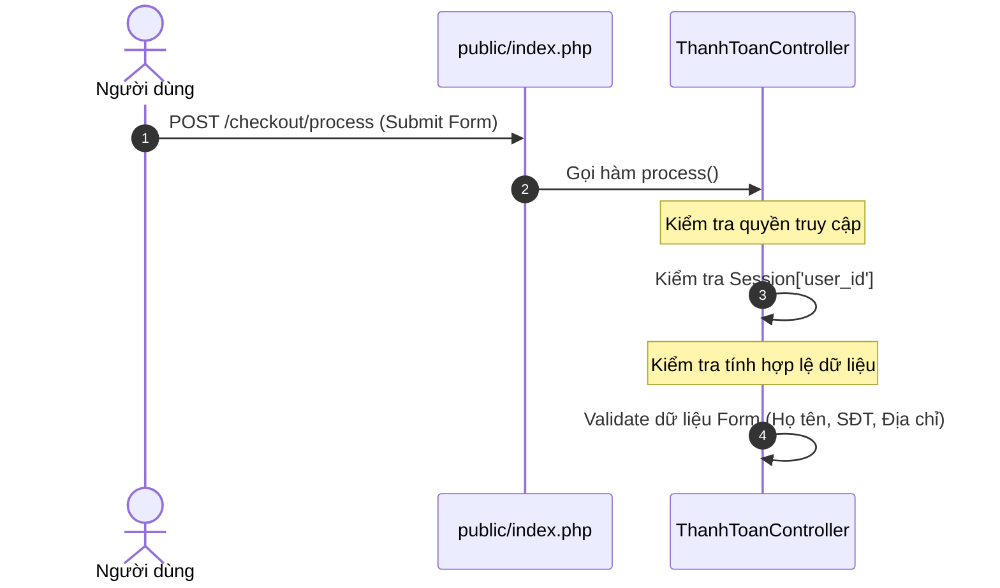
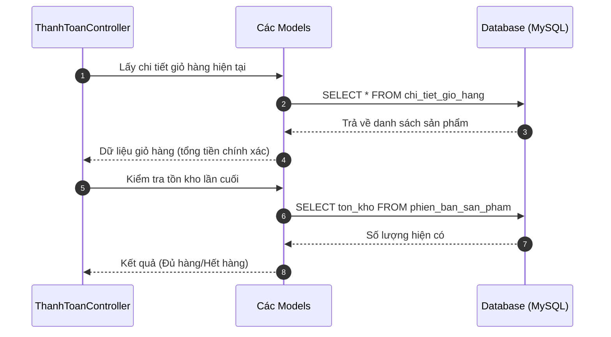
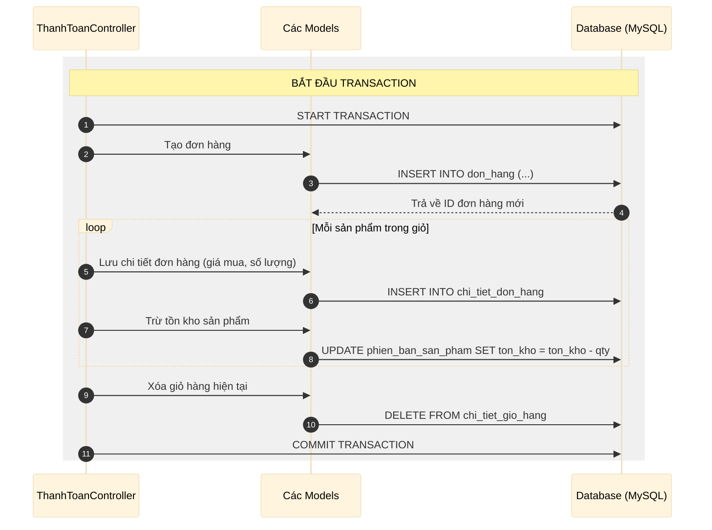
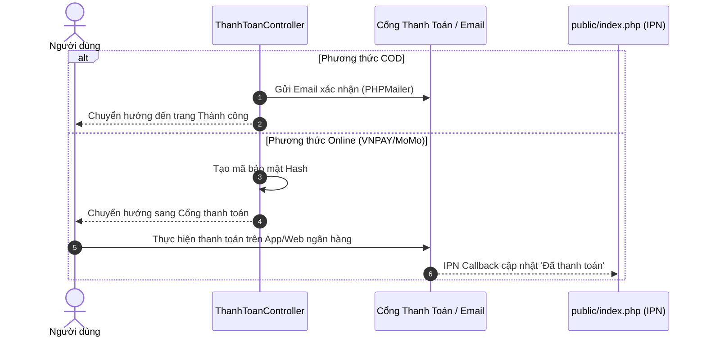

### 1. Khởi tạo và xác thực

```mermaid
sequenceDiagram
    autonumber
    actor User as Người dùng
    participant Router as public/index.php
    participant Ctrl as ThanhToanController
    
    User->>Router: POST /checkout/process (Submit Form)
    Router->>Ctrl: Gọi hàm process()
    
    %% Auth & Validate
    Note over Ctrl: Kiểm tra quyền truy cập
    Ctrl->>Ctrl: Kiểm tra Session['user_id']
    Note over Ctrl: Kiểm tra tính hợp lệ dữ liệu
    Ctrl->>Ctrl: Validate dữ liệu Form (Họ tên, SĐT, Địa chỉ)
```
### 2. Lấy dữ liệu và kiểm tra kho

```mermaid
sequenceDiagram
    autonumber
    participant Ctrl as ThanhToanController
    participant Model as Các Models
    participant DB as Database (MySQL)
    
    %% Logic & DB
    Ctrl->>Model: Lấy chi tiết giỏ hàng hiện tại
    Model->>DB: SELECT * FROM chi_tiet_gio_hang
    DB-->>Model: Trả về danh sách sản phẩm
    Model-->>Ctrl: Dữ liệu giỏ hàng (tổng tiền chính xác)
    
    Ctrl->>Model: Kiểm tra tồn kho lần cuối
    Model->>DB: SELECT ton_kho FROM phien_ban_san_pham
    DB-->>Model: Số lượng hiện có
    Model-->>Ctrl: Kết quả (Đủ hàng/Hết hàng)
```
### 3. Giao dịch Cơ sở dữ liệu

```mermaid
%%{init: { 'theme': 'base', 'themeVariables': { 'messageTextColor': '#000000', 'messageLineColor': '#000000', 'sequenceNumberColor': '#ffffff', 'noteTextColor': '#000000', 'actorTextColor': '#000000' }}}%%
sequenceDiagram
    autonumber
    participant Ctrl as ThanhToanController
    participant Model as Các Models
    participant DB as Database (MySQL)

    rect rgb(240, 240, 240)
        Note over Ctrl, DB: BẮT ĐẦU TRANSACTION
        
        Ctrl->>DB: START TRANSACTION
        
        Ctrl->>Model: Tạo đơn hàng
        Model->>DB: INSERT INTO don_hang (...)
        DB-->>Model: Trả về ID đơn hàng mới
        
        loop Mỗi sản phẩm trong giỏ
            Ctrl->>Model: Lưu chi tiết đơn hàng (giá mua, số lượng)
            Model->>DB: INSERT INTO chi_tiet_don_hang
            
            Ctrl->>Model: Trừ tồn kho sản phẩm
            Model->>DB: UPDATE phien_ban_san_pham SET ton_kho = ton_kho - qty
        end
        
        Ctrl->>Model: Xóa giỏ hàng hiện tại
        Model->>DB: DELETE FROM chi_tiet_gio_hang
        
        Ctrl->>DB: COMMIT TRANSACTION
    end
```
### 4. Thanh toán và phản hồi

```mermaid
sequenceDiagram
    autonumber
    actor User as Người dùng
    participant Ctrl as ThanhToanController
    participant 3rd as Cổng Thanh Toán / Email
    participant Router as public/index.php (IPN)

    alt Phương thức COD
        Ctrl->>3rd: Gửi Email xác nhận (PHPMailer)
        Ctrl-->>User: Chuyển hướng đến trang Thành công
    else Phương thức Online (VNPAY/MoMo)
        Ctrl->>Ctrl: Tạo mã bảo mật Hash
        Ctrl-->>User: Chuyển hướng sang Cổng thanh toán
        User->>3rd: Thực hiện thanh toán trên App/Web ngân hàng
        3rd-->>Router: IPN Callback cập nhật 'Đã thanh toán'
    end
```
