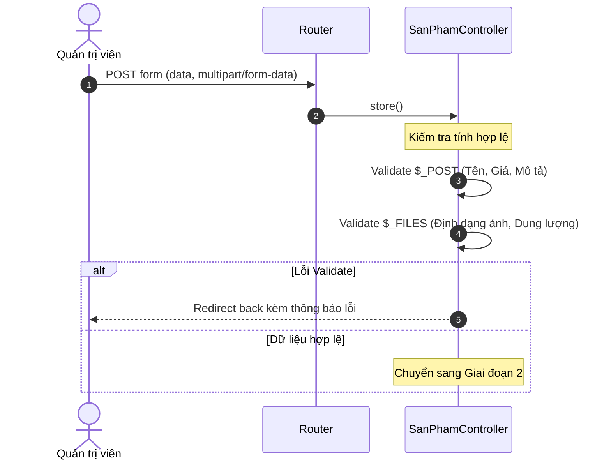
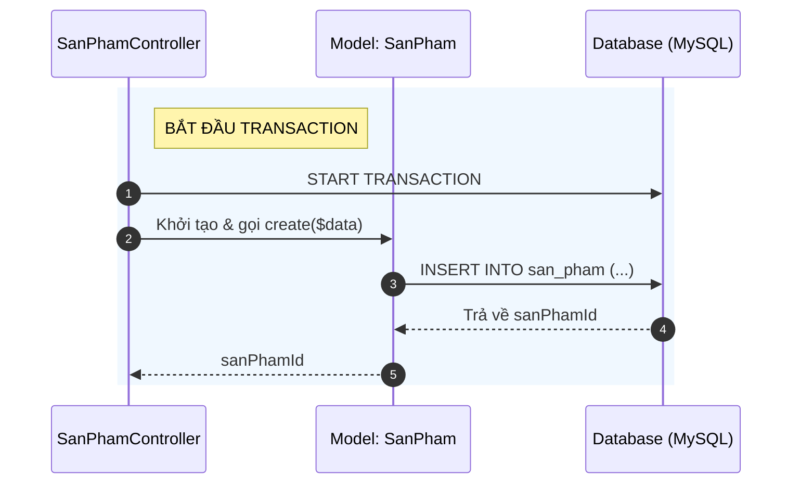
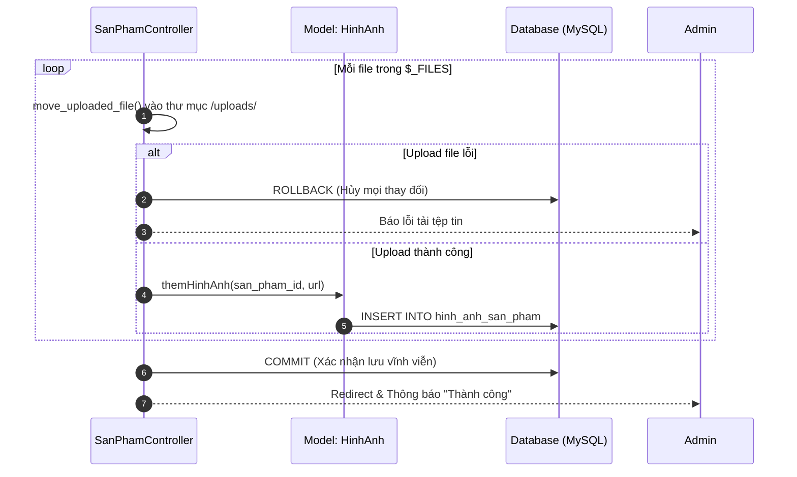

### 1. Tiếp nhận và Kiểm tra dữ liệu

```mermaid
sequenceDiagram
    autonumber
    actor Admin as Quản trị viên
    participant Router as Router
    participant Ctrl as SanPhamController

    Admin->>Router: POST form (data, multipart/form-data)
    Router->>Ctrl: store()
    
    Note over Ctrl: Kiểm tra tính hợp lệ
    Ctrl->>Ctrl: Validate $_POST (Tên, Giá, Mô tả)
    Ctrl->>Ctrl: Validate $_FILES (Định dạng ảnh, Dung lượng)
    
    alt Lỗi Validate
        Ctrl-->>Admin: Redirect back kèm thông báo lỗi
    else Dữ liệu hợp lệ
        Note over Ctrl: Chuyển sang Giai đoạn 2
    end
```

### 2. Khởi tạo Transaction và Lưu thông tin chính

```mermaid
sequenceDiagram
    autonumber
    participant Ctrl as SanPhamController
    participant ModelSP as Model: SanPham
    participant DB as Database (MySQL)

    rect rgb(240, 248, 255)
        Note right of Ctrl: BẮT ĐẦU TRANSACTION
        Ctrl->>DB: START TRANSACTION
        
        Ctrl->>ModelSP: Khởi tạo & gọi create($data)
        ModelSP->>DB: INSERT INTO san_pham (...)
        DB-->>ModelSP: Trả về sanPhamId
        ModelSP-->>Ctrl: sanPhamId
    end
```

### 3. Xử lý Hình ảnh & Hoàn tất

```mermaid
sequenceDiagram
    autonumber
    participant Ctrl as SanPhamController
    participant ModelHA as Model: HinhAnh
    participant DB as Database (MySQL)

    loop Mỗi file trong $_FILES
        Ctrl->>Ctrl: move_uploaded_file() vào thư mục /uploads/
        
        alt Upload file lỗi
            Ctrl->>DB: ROLLBACK (Hủy mọi thay đổi)
            Ctrl-->>Admin: Báo lỗi tải tệp tin
        else Upload thành công
            Ctrl->>ModelHA: themHinhAnh(san_pham_id, url)
            ModelHA->>DB: INSERT INTO hinh_anh_san_pham
        end
    end
    
    Ctrl->>DB: COMMIT (Xác nhận lưu vĩnh viễn)
    Ctrl-->>Admin: Redirect & Thông báo "Thành công"
```
