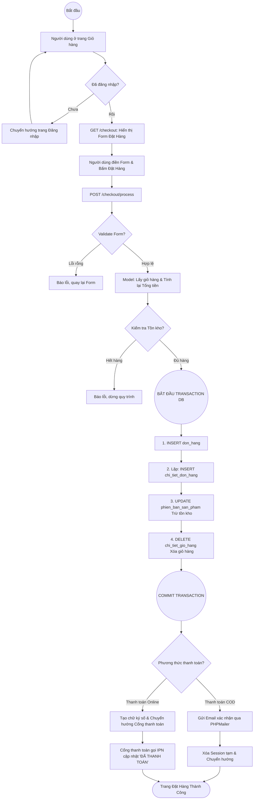

# process-diagram_web01
Sơ đồ quy trình

```mermaid
graph TD
    Start((Bắt đầu)) --> A[Người dùng ở trang Giỏ hàng]
    A --> B{Đã đăng nhập?}
    B -- Chưa --> C[Chuyển hướng trang Đăng nhập]
    C --> A
    B -- Rồi --> D[GET /checkout: Hiển thị Form Đặt Hàng]
    D --> E[Người dùng điền Form & Bấm Đặt Hàng]
    E --> F[POST /checkout/process]
    
    %% Validate & Check logic
    F --> G{Validate Form?}
    G -- Lỗi rỗng --> H[Báo lỗi, quay lại Form]
    G -- Hợp lệ --> I[Model: Lấy giỏ hàng & Tính lại Tổng tiền]
    I --> J{Kiểm tra Tồn kho?}
    J -- Hết hàng --> K[Báo lỗi, dừng quy trình]
    
    %% Transaction DB
    J -- Đủ hàng --> L((BẮT ĐẦU TRANSACTION DB))
    L --> M[1. INSERT don_hang]
    M --> N[2. Lặp: INSERT chi_tiet_don_hang]
    N --> O[3. UPDATE phien_ban_san_pham <br/> Trừ tồn kho]
    O --> P[4. DELETE chi_tiet_gio_hang <br/> Xóa giỏ hàng]
    P --> Q((COMMIT TRANSACTION))
    
    %% Post processing
    Q --> R{Phương thức thanh toán?}
    R -- Thanh toán Online --> S[Tạo chữ ký số & Chuyển hướng Cổng thanh toán]
    S --> T[Cổng thanh toán gọi IPN cập nhật 'ĐÃ THANH TOÁN']
    
    R -- Thanh toán COD --> U[Gửi Email xác nhận qua PHPMailer]
    U --> V[Xóa Session tạm & Chuyển hướng]
    V --> W([Trang Đặt Hàng Thành Công])
    T --> W
```
