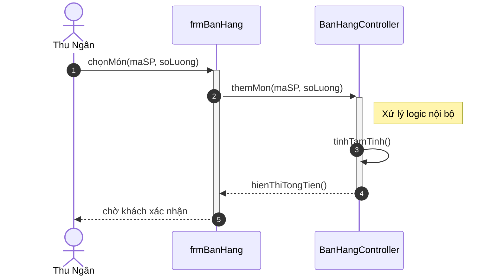
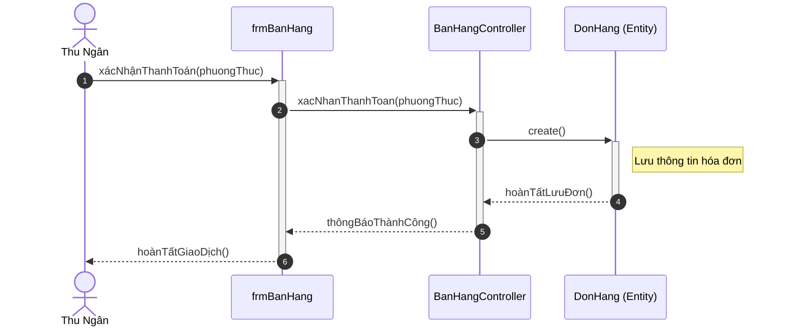
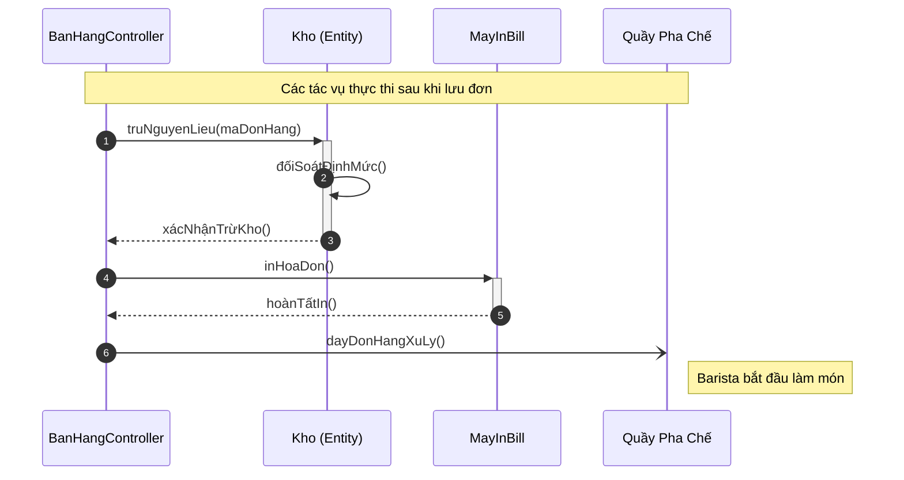

```mermaid
  sequenceDiagram
    autonumber
    actor TN as Thu Ngân
    participant View as frmBanHang
    participant Ctrl as BanHangController

    TN->>+View: chọnMón(maSP, soLuong)
    View->>+Ctrl: themMon(maSP, soLuong)
    
    Note right of Ctrl: Xử lý logic nội bộ
    Ctrl->>Ctrl: tinhTamTinh()
    
    Ctrl-->>-View: hienThiTongTien()
    View-->>-TN: chờ khách xác nhận
```

```mermaid
sequenceDiagram
    autonumber
    actor TN as Thu Ngân
    participant View as frmBanHang
    participant Ctrl as BanHangController
    participant DB_Order as DonHang (Entity)

    TN->>+View: xácNhậnThanhToán(phuongThuc)
    View->>+Ctrl: xacNhanThanhToan(phuongThuc)
    
    Ctrl->>+DB_Order: create()
    Note right of DB_Order: Lưu thông tin hóa đơn
    DB_Order-->>-Ctrl: hoànTấtLưuĐơn()
    
    Ctrl-->>-View: thôngBáoThànhCông()
    View-->>-TN: hoànTấtGiaoDịch()
```

```mermaid
sequenceDiagram
    autonumber
    participant Ctrl as BanHangController
    participant DB_Inv as Kho (Entity)
    participant Printer as MayInBill
    participant Barista as Quầy Pha Chế

    Note over Ctrl, Barista: Các tác vụ thực thi sau khi lưu đơn

    %% Luồng trừ kho
    Ctrl->>+DB_Inv: truNguyenLieu(maDonHang)
    DB_Inv->>DB_Inv: đốiSoátĐịnhMức()
    DB_Inv-->>-Ctrl: xácNhậnTrừKho()

    %% Luồng in ấn
    Ctrl->>+Printer: inHoaDon()
    Printer-->>-Ctrl: hoànTấtIn()

    %% Luồng điều phối không đồng bộ
    Ctrl-)Barista: dayDonHangXuLy()
    Note right of Barista: Barista bắt đầu làm món
```
