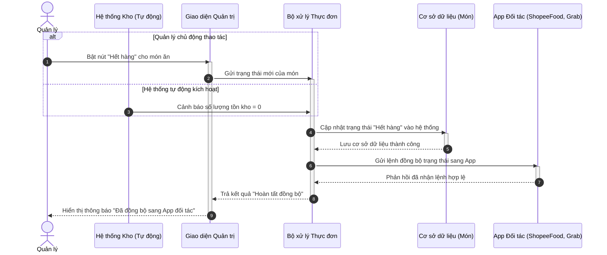
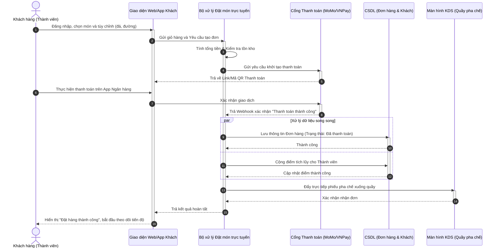
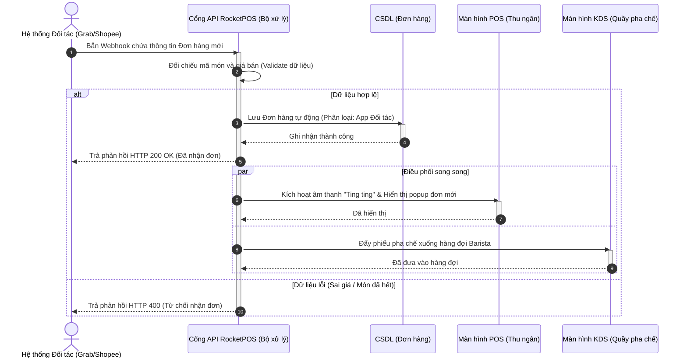
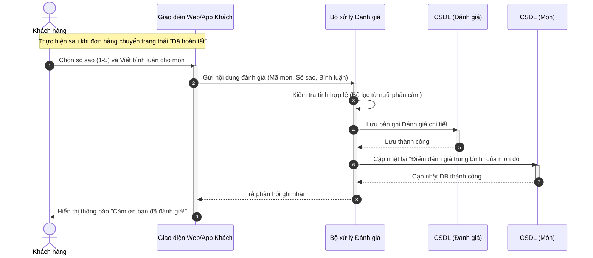

# Ngừng bán món và Đồng bộ lên App đối tác

```mermaid
sequenceDiagram
    autonumber
    actor QL as Quản lý
    participant HTK as Hệ thống Kho (Tự động)
    participant View as Giao diện Quản trị
    participant Ctrl as Bộ xử lý Thực đơn
    participant ModelMon as Cơ sở dữ liệu (Món)
    participant API as App Đối tác (ShopeeFood, Grab)

    alt Quản lý chủ động thao tác
        QL->>View: Bật nút "Hết hàng" cho món ăn
        activate View
        View->>Ctrl: Gửi trạng thái mới của món
        activate Ctrl
    else Hệ thống tự động kích hoạt
        HTK->>Ctrl: Cảnh báo số lượng tồn kho = 0
    end

    Ctrl->>ModelMon: Cập nhật trạng thái "Hết hàng" vào hệ thống
    activate ModelMon
    ModelMon-->>Ctrl: Lưu cơ sở dữ liệu thành công
    deactivate ModelMon

    Ctrl->>API: Gửi lệnh đồng bộ trạng thái sang App
    activate API
    API-->>Ctrl: Phản hồi đã nhận lệnh hợp lệ
    deactivate API

    Ctrl-->>View: Trả kết quả "Hoàn tất đồng bộ"
    deactivate Ctrl
    
    View-->>QL: Hiển thị thông báo "Đã đồng bộ sang App đối tác"
    deactivate View
```
# Khách hàng tự đặt món trực tuyến và Tích điểm

```mermaid
sequenceDiagram
    autonumber
    actor KH as Khách hàng (Thành viên)
    participant View as Giao diện Web/App Khách
    participant Ctrl as Bộ xử lý Đặt món trực tuyến
    participant CTT as Cổng Thanh toán (MoMo/VNPay)
    participant ModelDH as CSDL (Đơn hàng & Khách)
    participant KDS as Màn hình KDS (Quầy pha chế)

    KH->>View: Đăng nhập, chọn món và tùy chỉnh (đá, đường)
    activate View
    View->>Ctrl: Gửi giỏ hàng và Yêu cầu tạo đơn
    activate Ctrl

    Ctrl->>Ctrl: Tính tổng tiền & Kiểm tra tồn kho
    Ctrl->>CTT: Gửi yêu cầu khởi tạo thanh toán
    activate CTT
    CTT-->>View: Trả về Link/Mã QR Thanh toán
    deactivate CTT

    KH->>View: Thực hiện thanh toán trên App Ngân hàng
    View->>CTT: Xác nhận giao dịch
    activate CTT
    CTT-->>Ctrl: Trả Webhook xác nhận "Thanh toán thành công"
    deactivate CTT

    par Xử lý dữ liệu song song
        Ctrl->>ModelDH: Lưu thông tin Đơn hàng (Trạng thái: Đã thanh toán)
        activate ModelDH
        ModelDH-->>Ctrl: Thành công
    and
        Ctrl->>ModelDH: Cộng điểm tích lũy cho Thành viên
        ModelDH-->>Ctrl: Cập nhật điểm thành công
        deactivate ModelDH
    end

    Ctrl->>KDS: Đẩy trực tiếp phiếu pha chế xuống quầy
    activate KDS
    KDS-->>Ctrl: Xác nhận nhận đơn
    deactivate KDS

    Ctrl-->>View: Trả kết quả hoàn tất
    deactivate Ctrl
    View-->>KH: Hiển thị "Đặt hàng thành công", bắt đầu theo dõi tiến độ
    deactivate View
```
# Tiếp nhận đơn hàng tự động từ App Đối tác

```mermaid
sequenceDiagram
    autonumber
    actor API as Hệ thống Đối tác (Grab/Shopee)
    participant Ctrl as Cổng API RocketPOS (Bộ xử lý)
    participant ModelDH as CSDL (Đơn hàng)
    participant POS as Màn hình POS (Thu ngân)
    participant KDS as Màn hình KDS (Quầy pha chế)

    API->>Ctrl: Bắn Webhook chứa thông tin Đơn hàng mới
    activate Ctrl
    
    Ctrl->>Ctrl: Đối chiếu mã món và giá bán (Validate dữ liệu)
    
    alt Dữ liệu hợp lệ
        Ctrl->>ModelDH: Lưu Đơn hàng tự động (Phân loại: App Đối tác)
        activate ModelDH
        ModelDH-->>Ctrl: Ghi nhận thành công
        deactivate ModelDH
        
        Ctrl-->>API: Trả phản hồi HTTP 200 OK (Đã nhận đơn)
        
        par Điều phối song song
            Ctrl->>POS: Kích hoạt âm thanh "Ting ting" & Hiển thị popup đơn mới
            activate POS
            POS-->>Ctrl: Đã hiển thị
            deactivate POS
        and
            Ctrl->>KDS: Đẩy phiếu pha chế xuống hàng đợi Barista
            activate KDS
            KDS-->>Ctrl: Đã đưa vào hàng đợi
            deactivate KDS
        end
    else Dữ liệu lỗi (Sai giá / Món đã hết)
        Ctrl-->>API: Trả phản hồi HTTP 400 (Từ chối nhận đơn)
    end
    
    deactivate Ctrl
```
# Khách hàng đánh giá món

```mermaid
sequenceDiagram
    autonumber
    actor KH as Khách hàng
    participant View as Giao diện Web/App Khách
    participant Ctrl as Bộ xử lý Đánh giá
    participant ModelDG as CSDL (Đánh giá)
    participant ModelMon as CSDL (Món)

    Note over KH, View: Thực hiện sau khi đơn hàng chuyển trạng thái "Đã hoàn tất"
    
    KH->>View: Chọn số sao (1-5) và Viết bình luận cho món
    activate View
    View->>Ctrl: Gửi nội dung đánh giá (Mã món, Số sao, Bình luận)
    activate Ctrl

    Ctrl->>Ctrl: Kiểm tra tính hợp lệ (Bộ lọc từ ngữ phản cảm)
    
    Ctrl->>ModelDG: Lưu bản ghi Đánh giá chi tiết
    activate ModelDG
    ModelDG-->>Ctrl: Lưu thành công
    deactivate ModelDG

    Ctrl->>ModelMon: Cập nhật lại "Điểm đánh giá trung bình" của món đó
    activate ModelMon
    ModelMon-->>Ctrl: Cập nhật DB thành công
    deactivate ModelMon

    Ctrl-->>View: Trả phản hồi ghi nhận
    deactivate Ctrl
    
    View-->>KH: Hiển thị thông báo "Cám ơn bạn đã đánh giá!"
    deactivate View
```
